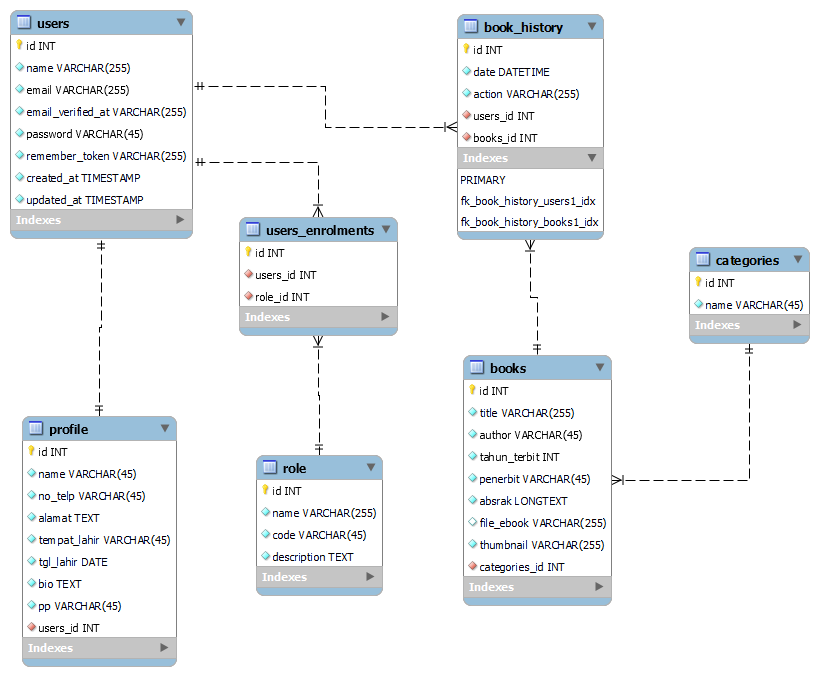

# UTS Pemograman Web 2

# Anggota Kelompok

<ul>
    <li><b></b>Ikhsan Fauzan - D112121054</li>
</ul>
<ul>
    <li><b></b> Nur Hidayat - D112121057</li>
</ul>
<ul>
    <li><b></b>Riyan - D112121062</li>
</ul>
 

# Tema Project :
E-Libs (Electronic Library)  

# ERD Desain

# Link Video Demo

1. <a href="javascript:;">x</a>  

# Link Deploy
<b>Link Deploy:</b> <a href="https://elibs-dev.techside.my.id">elibs-dev.techside.my.id</a>

Note Test Web Deploy:
    <b>Login Account : </b> 
    <b>Email :</b> admin@gmail.com 
    <b>Password :</b> admin 
atau register sebagai Anggota.